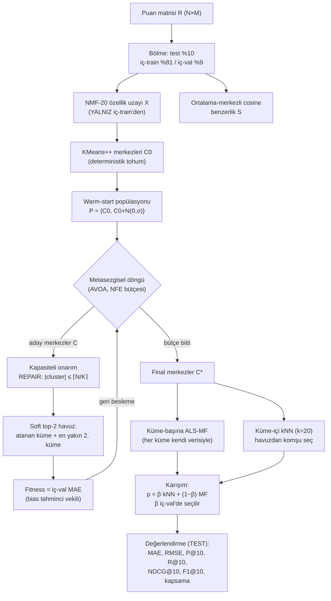

# Önerilen Yöntem — Akış Diyagramı ve Sözde Kod

Yöntem adı önerisi: **CAMC-CF** — *Capacity-Aware Metaheuristic Clustering for
Collaborative Filtering* (Kapasite-Farkındalıklı Metasezgisel Kümelemeli CF)

---

## 1. Akış diyagramı (metin/Mermaid)



**Sızıntı bariyerleri (diyagramda kırmızı çizgi olarak gösterilecek):**
- NMF, benzerlik, küme-MF: yalnız **iç-train**
- Fitness ve β seçimi: yalnız **iç-val**
- Test yalnızca son kutuda, tek atış

---

## 2. Sözde kod — ana algoritma

```
ALGORITMA CAMC-CF
GİRDİ : R (puan matrisi), K (küme/bütçe), B_NFE (arama bütçesi),
        k_nn (komşu sayısı), f (MF faktör), λ (MF düzenlileştirme)
ÇIKTI : tahmin fonksiyonu p(u,i)

 1: (R_tr, R_val, R_te) ← BÖL(R, %81/%9/%10)            # kullanıcı-bazlı rastgele
 2: X ← NMF(R_tr, d=20)                                  # özellik uzayı
 3: S ← COSINE(ORTALAMA_MERKEZLE(R_tr))                  # kullanıcı benzerliği
 4: C₀ ← KMEANS++(X, K, n_init=10)                       # deterministik tohum
 5: P ← {C₀} ∪ {C₀ + 𝒩(0, σ·std(X)) : j = 1..pop−1}      # warm-start popülasyonu
 6: C* ← METASEZGİSEL(P, fitness=F, bütçe=B_NFE)         # AVOA
 7: (L, near) ← ONARIMLI_ATA(X, C*)                      # kapasiteli
 8: for c = 1..K:  M_c ← ALS_MF(R_tr[L = c], f, λ)       # küme-başına MF
 9: return p(u,i) = clip(β·kNN(u,i) + (1−β)·M_{L[u]}(u,i), 1, 5)
```

```
FONKSİYON F(C)                                    # fitness (iç-val MAE)
 1: (L, near) ← ONARIMLI_ATA(X, C)
 2: dev[c,i] ← ortalama(r_ui − r̄_u) ,  (u,i) ∈ R_tr, L[u]=c
 3: for (u,i) ∈ R_val:
 4:     a,b ← near[u,0], near[u,1]                # soft top-2 havuz
 5:     d ← (dev[a,i]·n[a,i] + dev[b,i]·n[b,i]) / (n[a,i]+n[b,i])
 6:     p̂ ← clip(r̄_u + d, 1, 5)
 7: return ortalama|p̂ − r|                       # MİNİMİZE edilir
```

```
FONKSİYON ONARIMLI_ATA(X, C)                      # kapasiteli atama (repair)
 1: cap ← ⌈N / K⌉                                 # her küme en fazla cap üye
 2: D[u,c] ← ‖X_u − C_c‖²        (= ‖X_u‖² − 2X_u·C_c + ‖C_c‖²)
 3: sizes ← 0
 4: for u ∈ SIRALA(kullanıcılar, artan min_c D[u,c]):   # en "emin" olan önce
 5:     for c ∈ SIRALA(kümeler, artan D[u,c]):
 6:         if sizes[c] < cap:  L[u] ← c ; sizes[c] += 1 ; break
 7: near[u,0] ← L[u] ;  near[u,1] ← en yakın diğer küme
 8: return (L, near)
```

```
FONKSİYON kNN(u, i)                               # küme-içi komşuluk
 1: havuz ← {v : L[v] ∈ near[u]}                  # ≈ 2N/K kişi
 2: aday ← {v ∈ havuz : r_vi tanımlı}
 3: T ← aday içinde S[u,·] en yüksek k_nn kişi
 4: if T = ∅ : return TANIMSIZ                    # → fallback: r̄_u + dev_global[i]
 5: return r̄_u + Σ_{v∈T} S[u,v]·(r_vi − r̄_v) / Σ|S[u,v]|
```

**Karmaşıklık:** atama O(N·K log K); fitness O(|R_val| + N·K·d); tahmin
O(|havuz|) = O(2N/K) — kümesiz kNN'in K/2 katı ucuz.

---

## 3. E2 — Ölçeklenebilirlik tablosu (ML-1M, fold 1)

| K | Havuz | Havuz % | Hız kazancı (kümesize göre) | B0 süre (s) | AVOA süre (s) | AVOA MAE |
|---|---|---|---|---|---|---|
| 6 | 2013 | %33 | 3× | 10.3 | 19.3 | 0.6876 |
| 10 | 1208 | %20 | 5× | 11.2 | 21.6 | 0.6912 |
| 20 | 604 | %10 | 10× | 13.8 | 26.9 | 0.6986 |
| 40 | 302 | %5 | **20×** | 17.5 | 38.4 | 0.7066 |
| 60 | 201 | %3 | **30×** | 22.3 | 48.0 | 0.7125 |

- Çevrimiçi tahmin maliyeti havuzla doğru orantılı → K=40'ta komşuluk araması
  kümesiz sisteme göre **20 kat ucuz**, MAE bedeli 0.019 (%2.7).
- Süre sütunları optimizasyon dahil **çevrimdışı** maliyet; metalar B0'ın ~2 katı
  ama bu bir kereye mahsus.

## 4. E6 — ML-100K vs ML-1M (aynı protokol, K=40)

| Yöntem | ML-100K MAE | ML-1M MAE | 100K'da B0 farkı | 1M'de B0 farkı |
|---|---|---|---|---|
| **AVOA** | **0.7709** | **0.7068** | **−0.0306** | **−0.0166** |
| HHO | 0.7954 | 0.7189 | −0.0061 | −0.0045 |
| HGS | 0.7970 | 0.7189 | −0.0045 | −0.0044 |
| NGO | 0.7950 | 0.7193 | −0.0065 | −0.0041 |
| B0 | 0.8015 | 0.7234 | — | — |
| GWO | 0.8011 | 0.7235 | −0.0004 | +0.0001 |

**Sıralamalar:** 100K → AVOA, NGO, HHO, HGS, GWO, B0 ·
1M → AVOA, HHO, HGS, NGO, B0, GWO

Ortak desen (genelleme kanıtı):
1. **AVOA her iki veri setinde de birinci ve farkı diğerlerinin ~4 katı.**
2. **GWO her iki setinde de B0'dan ayrışamıyor** (−0.0004 / +0.0001).
3. Orta grup (HHO/HGS/NGO) her iki sette de birbirine çok yakın (0.0004 aralık),
   sıralama içlerinde değişiyor → aralarındaki fark gürültü, AVOA ile farkları değil.
