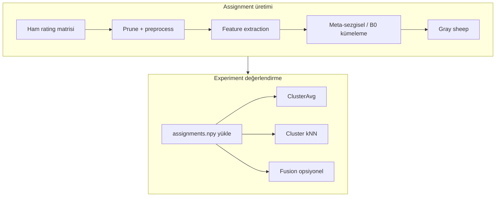

# Metodoloji: Kavramlar, Neden ve Nasıl Çalışır

Bu doküman, hybrid recommendation pipeline’ındaki **yöntemleri** açıklar: ne işe yararlar, **neden** kullanılırlar, kodda **nasıl** uygulanırlar. Komut satırı eşlemesi için: `docs/PARAMETRELER_EXPERIMENT_ASSIGNMENT.md`.

---

## 1. Genel akış

**Assignment:** Kullanıcıları K kümeye ayırır (sabit partition).  
**Experiment:** Aynı train/test bölmesinde bu partition üzerinde tahmin yapar; kümeleme tekrar öğrenilmez.

---

## 2. Veri budama (prune)

**Ne:** Seyrek kullanıcı–film matrisinden çok az etkileşimli satır/sütunları iteratif olarak çıkarır.

**Neden:** Çok seyrek kullanıcı/film benzerlik ve centroid hesabını güvenilmez yapar; literatürde sık kullanılan eşikler (ör. kullanıcı ≥5, film ≥10 rating).

**Nasıl:** `prune_sparse_matrix` — önce kullanıcı sayısı eşiğin altındakiler, sonra film sayısı; matris boyutu sabitlenene kadar döngü. `--no-prune` ile kapalı; indeks haritası `knn_mae` fitness’ta rating’leri yeniden eşlemek için saklanır.

---

## 3. Ön işleme (preprocess)

Kümeleme **öncesinde** dense matrise uygulanır (`prepare_matrix_for_clustering` sırası: prune → z-score/PCA → WNMF → sonra preprocess scaler).

| Yöntem | Ne yapar | Neden |
|--------|----------|--------|
| **none** | Ek ölçekleme yok (feature matrisi olduğu gibi) | WNMF/NMF çıktısı zaten anlamlı ölçekte; meta deneylerde tercih |
| **minmax** | Her özelliği [0,1] | Eski varsayılan; farklı ölçekli sütunları eşitler |
| **zscore** (satır) | Global `StandardScaler` tüm hücrelere | Merkez + ölçek; negatif değer üretebilir → NMF öncesi dikkat |
| **maxabs** | [-1,1] aralığına ölçekler, işaret korunur | Seyrek pozitif rating’lerde alternatif |

**Kullanıcı bazlı z-score** (`--zscore`, prune sonrası): Her kullanıcının *kendi* rating’lerini standartlaştırır; 0 hücreler dokunulmaz. Ardından satır **L2 normalize** — Pearson benzerliği ile KMeans geometrisini hizalamak için.

**Paper sütun z-score** (`paper_style`): Film bazlı ortalama/std; GOA makalesi protokolü.

---

## 4. Özellik çıkarma (feature extraction)

Amaç: Yüksek boyutlu seyrek rating matrisini **K kümeleme için** düşük boyutlu kullanıcı vektörü uzayına indirmek.

### 4.1 WNMF (Weighted / gözlemli NMF)

**Ne:** Yalnızca rating verilmiş (u,i) hücrelerini kullanarak kullanıcı latent `U` öğrenir; 0 = “bilinmiyor”, sıfır rating değil.

**Neden:** Standart NMF tüm matrisi doldurur; MovieLens’te 0’lar eksik veri. WNMF, downstream WNMF deneyleriyle aynı `WNMFModel` çekirdeğini kullanır.

**Nasıl:** `wnmf_feature_extract` → triplets üzerinde SGD, `init_method` (inmed / random), çıktı `U` (n_users × d), genelde L2 normalize.

### 4.2 NMF / “svd” seçeneği

CLI’de `--feature-extraction svd` aslında **sklearn NMF** (`nndsvda` init) çalıştırır; isim tarihsel. `nmf` seçeneği negatifleri sıfırlayıp klasik NMF uygular.

**Neden:** Non-negative latent uzay; rating benzeri veri için yorumlanabilir.

**Fark WNMF’den:** NMF tüm `R_matrix` üzerinde fit; sıfırlar “düşük rating” gibi işlenebilir.

### 4.3 PCA

**Ne:** Doğrusal varyansı koruyarak boyut indirgeme; `--pca 0.80` ile birikimli varyans eşiği.

**Neden:** Hızlı, lineer baseline; paper-mode’da sütun z-score sonrası PCA-50 benzeri.

**WNMF ile:** Aynı koşuda ikisi birlikte açılamaz (farklı pipeline dalları).

### 4.4 none

Ham (preprocess edilmiş) matris doğrudan kümeleme girdisi; yüksek boyut, yavaş meta arama.

---

## 5. Küme mesafesi ve cluster metric

Meta-sezgisel **fitness** ve atama, centroid’lere uzaklık üzerinden yapılır (`compute_wcss_fast`).

| `--cluster-metric` | Uzaklık | Ne zaman |
|--------------------|---------|----------|
| **euclidean** | \(\|x_i - c_k\|^2\) toplamı (WCSS / inertia) | WNMF latent, L2-normalize uzay |
| **pearson** | \(1 - \mathrm{corr}(x_i, c_k)\); yalnız ortak/aktif boyutlar | Ham veya z-score rating uzayı |
| **fuzzy** | FCM üyelik + bulanık centroid güncellemesi | `--fcm`; `memberships.npy` üretir |

**Neden euclidean + WNMF:** Latent vektörler sürekli; Öklid KMeans ile uyumlu. Pearson seyrek satırlarda “ortak filmlerde profil benzerliği” vurgular.

**FCM:** Her kullanıcı K kümeye **yumuşak** üyelik; hard label `argmax` membership. ClusterAvg’de soft blend (`SOFT_MEMBERSHIP_THRESHOLD`) mümkün.

---

## 6. Başlangıç: MkMeans++ ve B0

### 6.1 MkMeans++ (`--init-mode mkpp`)

**Ne:** k-means++ benzeri olasılıklı centroid seçimi; mesafe karesi ile ağırlıklandırılmış yeni merkez.

**Neden:** Rastgele init boş/çok küçük kümeler ve kötü yerel minimum üretir; meta popülasyonu kaliteli başlar.

**Nasıl:** `mkmeans_plus_plus_init` — birçok aday üretilir, `make_fitness_function` ile skorlanır, en iyi `pop_size` adet Mealpy’ye `starting_solutions` olur.

### 6.2 B0_KMEANS çalışma mantığı

**Ne:** **Doğrudan** sklearn `KMeans` — meta-sezgisel yok.

**Neden:** Altın standart baseline: “iyi bir KMeans ile aynı uzayda meta ne kazandırıyor?” sorusu.

**Nasıl:**
- `n_init=10`, `max_iter=500`, `random_state=42`
- Girdi: pipeline’dan gelen `user_matrix` (WNMF U veya NMF vb.)
- Çıktı: `labels`, `cluster_centers_`, `inertia` → `assignments.npy`, `best_sol.npy`
- `knn_mae` / `CentroidOptimizer` **B0’da çalışmaz** (yalnızca meta dallar)

**`--init random` (B0):** sklearn `init='random'` — yalnızca B0 dalında; meta için `_irand` farklı mantık (K rastgele kullanıcı satırı).

---

## 7. Lloyd iterasyonu ve kmref

### 7.1 Lloyd (KMeans iç çekirdeği)

Tekrarlayan iki adım:
1. **Atama:** Her noktayı en yakın centroid’e bağla.
2. **Güncelleme:** Her kümenin centroid’i = kümedeki noktaların ortalaması.

Öklid WCSS’i monoton azaltır; yerel optimum.

### 7.2 `--kmeans-refine` (kmref)

**Ne:** Meta algoritma centroid bulduktan sonra sklearn KMeans: `init=meta_centroids`, `n_init=1`, Lloyd devam.

**Neden:**
- Boş/dejenere kümeleri onarır
- WCSS’i meta raporundan daha düşük geometrik inertia’ya çeker

**Eksi:** Farklı meta çözümleri benzer atamalara **yakınsar** → downstream tahminler birbirine çok korelasyonlu olur.

**B0:** Zaten tam KMeans; kmref **atlanır**.

---

## 8. Meta objective ve fitness türleri

### 8.1 `--cluster-objective multi` (varsayılan)

Meta minimize eder (normalize + cezalar):

\[
0.5 \cdot \widehat{\mathrm{WCSS}} + 0.25 \cdot (1 - \mathrm{sil}) + 0.25 \cdot \frac{1}{\mathrm{CH}}
\]

- **WCSS:** Küme içi toplam mesafe (ölçek: ilk çözüm baseline)
- **Silhouette (cosine, örnek):** Küme ayrışması; yüksek sil → düşük terim
- **Calinski–Harabasz:** Kümeler arası / içi varyans oranı
- **Cezalar:** Boş küme, çok küçük küme, aşırı büyük küme

**Neden:** Tek WCSS bazen dev tek küme veya boş kümeye kayar; çok amaçlı skor dengeler.

### 8.2 `--cluster-objective wcss` (`_pwcss`)

Saf WCSS (+ boş küme cezası `1e6`). B0 ile **aynı optimizasyon hedefi**; meta karşılaştırması daha adil.

### 8.3 `--fitness knn_mae` (centroid arama)

**Ne:** `CentroidOptimizer` her aday centroid seti için `ClusterPredictor` ile holdout **MAE** hesaplar; minimize eder.

**Neden:** Kümeleme hedefi (WCSS) ≠ öneri kalitesi (MAE); meta’yı doğrudan downstream’e hizalar.

**Alt parametreler:** `centroid-knn-k`, `centroid-knn-sim`, train/val örneklemesi — bkz. `centroid_optimizer.py`.

### 8.4 `knn_mae_legacy` / `latent_dev`

- **legacy:** Hızlı Pearson kNN, örneklemeli MAE (bias SGD yok).
- **latent_dev:** WNMF W uzayında küme üyelerinin centroid’e ortalama sapması (proxy).

---

## 9. Gray sheep: percentile ve LOF

**Amaç:** Küme içi “normal” kullanıcılardan **aykırı** profilleri işaretlemek; tahminde genelde **global kNN** (tüm white komşular) kullanılır.

### 9.1 Percentile (varsayılan, `--lof` yok)

**Nasıl:** Kullanıcının atandığı centroid’e uzaklık (euclidean veya 1−pearson); **80. percentile** üstü = gray.

**Neden basit:** Sabit ~%20 aykırı; yorum: “kendi kümesine göre uzak”.

### 9.2 LOF (`--lof`)

**Nasıl:** 4 özellik (ort. rating, rating sayısı, std, küme-içi sapma) → z-score → `LocalOutlierFactor`; `prediction==-1` → gray. Ek olarak SVD-Uzayında ikinci LOF ile maske birleştirilebilir.

**Neden:** Eşik veriden gelir; “neden %20?” sorusuna metodolojik cevap.

**`--no-gray-sheep`:** Maske tamamen False; tüm kullanıcılar white.

---

## 10. Kaydedilen küme metrikleri (`cluster_metrics.csv`)

| Metrik | Anlam | Nasıl |
|--------|--------|--------|
| **WCSS** | Optimizer’ın raporladığı küme içi toplam mesafe | `best_fit` / yeniden `compute_wcss_fast` |
| **silhouette_euclidean / cosine** | WNMF U uzayında küme ayrışması | sklearn `silhouette_score`, gray hariç, max 500 örnek |
| **n_gray_sheep, K** | Aykırı sayısı, küme sayısı | `assignment_summary` ile birlikte |

**Yorum:** Yüksek silhouette → latent uzayda kümeler ayrışık; düşük WCSS → sıkı kümeler. Downstream MAE ile **zorunlu** örtüşmez.

---

## 11. Küme benzerliği: ARI, NMI, agreement

Farklı **assignment** dosyalarını karşılaştırır (aynı kullanıcı seti, aynı K).

| Metrik | Ne ölçer | Aralık / yorum |
|--------|----------|----------------|
| **Agreement** | Aynı küme etiketine sahip kullanıcı oranı | 0–1; etiket permütasyonuna duyarlı |
| **ARI** (Adjusted Rand Index) | Rastgele atamaya göre düzeltilmiş örtüşme | ≈1: neredeyse aynı partition; ≈0: rastgele |
| **NMI** | Karşılıklı bilgi; etiket isimleri önemsiz | Yüksek → benzer yapı |
| **Centroid distance** | `best_sol` centroid vektörleri arası mesafe | Düşük → benzer geometrik merkezler |

**Neden:** Meta’lar WCSS’te yakın ama farklı partition üretebilir (veya kmref sonrası hepsi benzer — ARI≈1).

**Kod:** `compare_grid_wnmf20_k5_k30.py`, `_tmp_compare_paper_runs.py`.

---

## 12. Jaccard@10 (değerlendirme)

**Ne:** Her test kullanıcısı için — **önerilen Top-10** film kümesi ile **gerçekten relevant** (rating ≥ eşik) film kümesinin Jaccard benzerliği; kullanıcılar üzerinde ortalama.

\[
J(u) = \frac{| \mathrm{Top10}(u) \cap \mathrm{Rel}(u) |}{| \mathrm{Top10}(u) \cup \mathrm{Rel}(u) |}
\]

**Neden:** Rating MAE’den farklı — **sıralama / öneri listesi** kalitesi; küme ortalaması senaryolarında Precision/Recall/NDCG ile birlikte raporlanır.

**Nasıl:** `_compute_topn_jaccard` — test satırlarından kullanıcı bazlı grupla, tahmine göre sırala, relevant eşiği `--relevance-threshold` veya `cluster-mean`.

---

## 13. Paired bootstrap CI ve Wilcoxon

**Soru:** Algoritma A, algoritma B’den **istatistiksel olarak** daha iyi mi (aynı test çiftlerinde)?

### 13.1 Paired bootstrap (`paired_bootstrap_ci.py`)

1. Aynı (u,i) için A ve B tahminleri üret (`run_cluster_knn`, `return_eval_rows=True`).
2. Satır bazlı hata: MAE için \(|y - \hat y_A| - |y - \hat y_B|\) → **Δ**.
3. Test satırlarından **bootstrap yeniden örnekleme** (çiftler korunur) → Δ dağılımı → %95 CI.
4. **p(A better):** Örneklerin oranı Δ < 0 (A daha düşük hata).

**Neden:** Tek MAE farkı örneklem varyansını göstermez; CI genişse “fark şans eseri olabilir”.

### 13.2 Wilcoxon signed-rank

Paired farkların medyanının sıfır olmadığına non-parametrik test; normallik varsayımı yok.

**Ne zaman:** Bootstrap CI ile birlikte rapor; ikisi de anlamlı → güçlü kanıt.

---

## 14. Tahmin yöntemleri (experiment)

### 14.1 ClusterAvg — ağırlıklı (varsayılan)

**Ne:** Küme içi kullanıcı benzerliği (Pearson/cosine) ile **ağırlıklı sapma**; taban `--cluster-avg-base`:
- `user` → kullanıcı ortalaması
- `cluster` → küme genel ortalaması
- `cluster_item_pop` → küme + item popülerlik düzeltmesi

**Neden:** Düz ortalamadan daha ince; komşu profiline benzer kullanıcılar daha çok etki eder.

**FCM:** `memberships.npy` varsa soft üyelik ile küme-item ortalaması karışımı.

### 14.2 ClusterAvg — hard (`--cluster-avg-hard`, CalcAvgRating)

**Ne:** Thakrar et al. (2025) tarzı — kümedeki kullanıcıların **düz** train ortalaması; item için küme×item ortalama; soft yok.

**Neden:** Makale baseline’ı ile birebir karşılaştırma (`--paper-mode`).

### 14.3 Cluster kNN — native (`ClusterPredictor`)

**Formül (küme c):**

\[
\hat r_{u,i} = \mu + b_u^{(c)}[u] + b_i^{(c)}[i] + \frac{\sum_{v \in N_c(u)} s_{uv}\,(r_{v,i} - \hat b_v^{(c)}(i))}{\sum |s_{uv}|}
\]

**Nasıl:**
1. Küme başına bias-only SGD (`b_u`, `b_i`)
2. Bias-merkezli sapma vektörleri üzerinde küme-içi cosine/Pearson benzerlik
3. Yalnız **aynı kümedeki** komşular; gray → global kNN (white komşular)

**Neden:** Surprise KNNBaseline’a yakın ama küme bias ve backend kontrolü; `knn_mae` fitness ile aynı aile.

### 14.4 Cluster kNN — Surprise baseline

`--cluster-knn-backend surprise`: `KNNBaseline` / `KNNWithMeans` / `CoClustering` — kütüphane içi optimizasyon.

### 14.5 Global KNN baseline

`--global-knn`, `--global-kwm`, `--global-knn-baseline`: **Kümeleme yok**; tüm kullanıcı havuzu.

**Neden:** “Kümeleme kNN’i iyileştiriyor mu?” sorusunun üst sınırı / referansı.

### 14.6 Shrinkage (`--lambda-shrink`)

Küme bazlı etkin ortalama: \(\mu_{\mathrm{eff},c} = \alpha_c \mu_c + (1-\alpha_c)\mu_{\mathrm{global}}\), \(\alpha_c = n_c/(n_c+\lambda)\).

**Neden:** Küçük kümelerde aşırı güvenilir küme ortalamasını global mean’e çeker.

---

## 15. Benzerlik (similarity)

| Ad | Tanım (sezgisel) | Kullanım |
|----|------------------|----------|
| **pearson** | Ortak item’larda merkezli korelasyon | Klasik CF |
| **pearson_iuf** | Pearson × inverse user frequency | Popüler item cezası |
| **cosine** | Sapma vektörleri cosine | Native `ClusterPredictor`, latent |
| **msd** | Mean squared difference (Surprise) | Surprise KNNWithMeans |

**min-common:** Benzerlik için en az ortak film sayısı; altında sim=0.

**sig_weight / sim_amp:** Düşük destekli komşuları bastırma / benzerlik üssü (opsiyonel).

---

## 16. Eval: official vs random

| Mod | ML-100K | ML-1M |
|-----|---------|-------|
| **official** | `u1.base` / `u1.test` (fold N → `uN`) | Kullanılmaz |
| **random** | `u.data` %20 holdout veya 5-fold KFold | Her zaman rastgele/KFold |

**Neden official:** MovieLens standart benchmark; sonuçları diğer makalelerle kıyas.

**Neden random:** HSC vb. protokoller; daha fazla train verisi tek fold’da.

**Kritik:** Assignment `--train-only` + experiment `--eval-split` / `--fold` **aynı** bölme olmalı.

---

## 17. Fusion (User-CF + Item-CF)

**Ne:** İki ayrı assignment:
- Kullanıcı kümeleri → küme-içi **user-based** kNN
- Film kümeleri (`item_assignments`) → küme-içi **item-based** kNN

\[
\hat r_{u,i} = m \cdot \hat r^{\mathrm{user}}_{u,i} + n \cdot \hat r^{\mathrm{item}}_{u,i}
\]

| Mod | m, n |
|-----|------|
| **fixed** | `fusion-alpha` = item ağırlığı; m=1−α, n=α |
| **dynamic** | Kullanıcı ve film centroid’leri arası cosine benzerliğine göre m,n |

**Neden:** User-CF ve Item-CF hataları farklı; hibrit daha robust olabilir.

**Gereksinim:** `--item-assign-root`, `--item-assign-suffix`, `--fusion`.

---

## 18. Hızlı karar tablosu

| Soru | Bakılacak |
|------|-----------|
| Kümeler latent uzayda iyi mi? | silhouette, WCSS |
| İki algo aynı partition mı? | ARI, agreement |
| Tahmin farkı anlamlı mı? | bootstrap CI, Wilcoxon |
| Öneri listesi kalitesi? | Jaccard@10, P@10, NDCG |
| Meta downstream’de ayrışıyor mu? | `diagnose_algo_pred_correlation`, kmref kapalı, `knn_mae` |
| Makale CalcAvgRating? | `--cluster-avg-hard` |

---

## 19. Kod referansları

| Konu | Dosya / fonksiyon |
|------|-------------------|
| Pipeline preprocess + FE | `generate_assignments.prepare_matrix_for_clustering` |
| WCSS, multi-objective, MkPP | `mealpy-algorithms-comparision.py` |
| B0, kmref, FCM, LOF | `generate_assignments._run_one_core` |
| MAE fitness | `centroid_optimizer.cluster_predictor_mae` |
| ClusterAvg / kNN | `wnmf_experiment.run_cluster_average`, `run_cluster_knn` |
| Native predictor | `cluster_predictor.ClusterPredictor` |
| Fusion | `wnmf_experiment.run_cluster_knn_fusion` |
| Jaccard | `wnmf_experiment._compute_topn_jaccard` |
| Bootstrap | `mealpy/paired_bootstrap_ci.py` |
| ARI grid | `mealpy/compare_grid_wnmf20_k5_k30.py` |
| Veri bölme | `wnmf_utils.load_ratings_100k`, `load_ratings_100k_all` |
