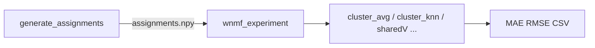

# Experiment ve Assignment Parametreleri

Bu doküman, **assignment üretimi** (`mealpy/generate_assignments.py`) ile **downstream değerlendirme** (`wnmf/wnmf_experiment.py`) arasındaki parametreleri, **neden eklendiklerini** ve **hangi değerlerin kritik olduğunu** özetler.

**Kavramlar ve yöntemlerin nasıl çalıştığı** (Jaccard, bootstrap, ARI, WNMF/NMF, Lloyd, LOF, ClusterAvg vs.): **`docs/METODOLOJI_KAVRAMLAR.md`**

İlgili dosyalar:
- `mealpy/generate_assignments.py` — küme ataması üretimi
- `mealpy/centroid_optimizer.py` — `knn_mae` fitness (centroid arama)
- `wnmf/cluster_predictor.py` — native küme-içi kNN + bias SGD
- `wnmf/wnmf_experiment.py` — tahmin ve metrik raporu
- `docs/META_MAE_FITNESS_ROADMAP.md` — meta-algo farkını gösterme yol haritası
- `docs/algoritma_ve_arguman_ozeti.md` — genel argüman sözlüğü (eski + temel)

---

## 1. Uçtan uca akış



1. **Assignment:** Meta-sezgisel (veya B0 KMeans) algoritma, WNMF/SVD uzayında centroid bulur → her kullanıcıya küme atar.
2. **Experiment:** Aynı train/test bölmesinde bu atamayı yükler → küme ortalaması, native kNN, WNMF vb. senaryoları çalıştırır.

**Kritik kural:** Experiment’te `--assign-suffix`, diskteki klasör adının **algoritma etiketinden sonraki kısmı** ile **birebir** eşleşmeli. Aksi halde yanlış (veya eksik) assignment okunur.

---

## 2. Klasör adı (suffix) anatomisi

`generate_assignments` yeni düzende tam yol:

```text
{out_root}/{dataset}/{LABEL}{out_suffix}{assign_suffix}/
```

| Parça | Kaynak | Örnek |
|--------|--------|--------|
| `out_suffix` | Budama, metrik, init, gray sheep, train-only | `_pruneu5_i10_euc_imkpp_nogs` |
| `assign_suffix` | preprocess + feature + latent + K + opsiyonlar | `_none_wnmf20_k27_kmref` |

`assign_suffix` kodda şöyle üretilir:

```text
_{preprocess}_{feature_extraction}{svd_components}_k{K}[_pwcss][_kmref]
```

| Ek | Parametre | Anlam |
|----|-----------|--------|
| `_pruneu5_i10` | varsayılan budama | Kullanıcı≥5, film≥10 rating |
| *(yok)* | `--no-prune` | Budama kapalı |
| `_zscore` | `--zscore` | Kullanıcı bazlı z-score |
| `_colzscore` | paper-style | Sütun z-score |
| `_pca80pct` | `--pca 0.80` | PCA varyans eşiği |
| `_euc` | `--cluster-metric euclidean` | Sürü fitness mesafesi |
| `_imkpp` / `_irand` | `--init-mode mkpp\|random` | Centroid başlangıcı |
| `_nogs` | `--no-gray-sheep` | Gray sheep kapalı |
| `_paper` | `--paper-mode` | GOA makale preset |
| `_trainonly_rand_f1` | `--train-only --fold 1` | Train-only + bölme etiketi |
| `_none_wnmf20_k27` | `--preprocess none --feature-extraction wnmf --svd-components 20 --k 27` | Çekirdek pipeline etiketi |
| `_pwcss` | `--cluster-objective wcss` | Meta fitness = saf WCSS |
| `_kmref` | `--kmeans-refine` (B0 hariç) | Lloyd refinement sonrası |

**Experiment tarafı:** `--assign-suffix` = `out_suffix` + `assign_suffix` (LABEL hariç tam sonek).

Örnek tam klasör adı:

```text
HA_AVOAHGS_pruneu5_i10_euc_imkpp_nogs_none_wnmf20_k27_kmref
         └──────── out_suffix ────────┘└──── assign_suffix ────┘
```

`wnmf_experiment` suffix sonunda `_k27` görürse `--k 27` ile uyumu kontrol eder; K artık label önüne `_k27` olarak eklenmez.

---

## 3. Assignment parametreleri (yeni / önemli)

### 3.1 Train–eval hizalama

| Parametre | Varsayılan | Neden eklendi |
|-----------|------------|----------------|
| `--train-only` | kapalı | Kümeleme matrisi yalnızca train; test sızıntısı yok. `wnmf_experiment` ile aynı holdout. |
| `--eval-split official\|random` | `random` | ML-100K: `u1.base/test` vs `u.data` %20 / KFold. |
| `--fold N` | yok | 1–5: tek fold veya KFold. **Yalnızca `--train-only` ile anlamlı.** |

**Önemli değerler:** Experiment’te `--eval-split` ve `--fold`, assignment üretimindekiyle **aynı** olmalı. Örnek: ikisinde de `--eval-split random --fold 1`.

`--fitness knn_mae` kullanıyorsanız `--train-only` **zorunlu değil** ama **şiddetle önerilir**; val örnekleri holdout/test’ten gelir.

---

### 3.2 Fitness: WCSS → downstream MAE

| Parametre | Varsayılan | Neden eklendi |
|-----------|------------|----------------|
| `--fitness wcss` | `wcss` | Klasik kümeleme: WCSS minimize. Hızlı; downstream MAE ile zayıf korelasyon. |
| `--fitness knn_mae` | — | Centroid aramada `ClusterPredictor` val **MAE** minimize edilir; meta farkının downstream’e yansıması hedeflenir. |
| `--fitness knn_mae_legacy` | — | Hızlı örneklemeli Pearson kNN MAE (pilot / debug). |
| `--fitness latent_dev` | — | WNMF latent uzayında sapma proxy’si; harici `--wnmf-model-path` gerekir. |

**`knn_mae` alt parametreleri** (`CentroidOptimizer` ↔ `ClusterPredictor`):

| Parametre | Varsayılan | Önem |
|-----------|------------|------|
| `--centroid-knn-k` | 20 | Fitness kNN komşu sayısı; pilot: 20–30, production: eval `--knn` ile hizalayın. |
| `--centroid-knn-sim` | `cosine` | `cosine` veya `pearson`; eval’de `--similarity cosine` önerilir. |
| `--centroid-train-sample` | 500 | kNN indeksi için train örneği; düşük = hızlı, gürültülü. |
| `--centroid-val-sample` | 200 | Fitness MAE örneği; artırınca daha stabil, yavaş. |
| `--centroid-bias-epochs` | 5 | Küme bias SGD; hız için 5, kalite için 10–20. |
| `--centroid-iter` | `BASELINE_EPOCH` | Meta epoch; pilot: 30, tam: 50+. |
| `--centroid-agents` | `POP_SIZE` | Popülasyon; pilot: 20. |
| `--min-common` | 3 | kNN min ortak item; assignment ve experiment’te aynı tutun. |

**Örnek (pilot, tek algo):**

```bash
python mealpy/generate_assignments.py --dataset 100k --k 30 \
  --algo B1_HHO --no-gray-sheep --no-prune \
  --preprocess none --feature-extraction wnmf --svd-components 20 \
  --init-mode mkpp --no-kmeans-refine \
  --fitness knn_mae --train-only --fold 1 \
  --centroid-knn-sim cosine --centroid-knn-k 30 \
  --centroid-val-sample 500 --centroid-iter 30 --centroid-agents 20
```

Beklenen suffix (kmref yok): `_euc_imkpp_nogs_none_wnmf20_k30` (+ varsa `_trainonly_rand_f1`).

---

### 3.3 KMeans refinement (`kmref`)

| Parametre | Varsayılan | Neden eklendi |
|-----------|------------|----------------|
| `--kmeans-refine` / `--no-kmeans-refine` | açık | Meta centroid’lerden sonra sklearn Lloyd adımları; WCSS’i iyileştirir, atamaları **homojenleştirir**. |
| `--kmeans-refine-iter` | 300 | Refinement iterasyon üst sınırı. |

**Önemli değer:**

| Senaryo | kmref | Sonuç |
|---------|-------|--------|
| WCSS raporu, hızlı grid | açık (`_kmref`) | Meta’lar birbirine yakın assignment |
| Meta farkını downstream’de göstermek | **kapalı** (`--no-kmeans-refine`, suffix’te `_kmref` yok) | Assignment çeşitliliği artar |
| Adil B0 karşılaştırma | B0 zaten KMeans; kmref B0’da atlanır | — |

Experiment `--assign-suffix` içinde `_kmref` varsa üretimde refinement açık demektir; yoksa `--no-kmeans-refine` ile üretilmiştir.

---

### 3.4 Özellik çıkarma ve metrik

| Parametre | Önerilen | Not |
|-----------|----------|-----|
| `--preprocess none` | meta + WNMF40 koşuları | `minmax` eski varsayılan; yeni senaryolarda `none` |
| `--feature-extraction wnmf` | WNMF latent | `--wnmf-features` **deprecated** → `--svd-components` |
| `--svd-components` | **20** (mevcut grid), **40** (Faz 2) | Suffix: `_wnmf20` / `_wnmf40` |
| `--cluster-metric euclidean` | WNMF ile | `auto` zaten WNMF’de `euclidean` seçer |
| `--init-mode mkpp` | meta | `_imkpp`; paper-mode’da `random` → `_irand` |
| `--no-gray-sheep` | meta MAE deneyleri | `_nogs`; LOF skorları üretilmez |
| `--no-prune` | tam kullanıcı seti | prune suffix’i silinir |
| `--cluster-objective wcss` | B0 ile aynı hedef | `_pwcss` eklenir |

---

### 3.5 Diğer assignment bayrakları

| Parametre | Amaç |
|-----------|------|
| `--skip-existing` | `assignments.npy` varsa algo atla |
| `--out-root` | Çıktı kökü (`assignments`, `assignments_lof`, …) |
| `--early-stop` + patience/tolerance | Uzun meta koşularda erken durma |
| `--jobs` | Algo düzeyinde paralel süreç |

---

## 4. Experiment parametreleri (yeni / önemli)

### 4.1 Assignment yükleme

| Parametre | Varsayılan | Neden / önem |
|-----------|------------|--------------|
| `--assign-root` | `mealpy/results/assignments_lof` | Assignment kök dizini; üretimdeki `--out-root` ile uyumlu olmalı. |
| `--assign-suffix` | `''` | Klasör soneki (Bölüm 2). **En sık hata kaynağı.** |
| `--k` | dataset varsayılanı | Suffix’te `_k{N}` varsa trailing K ile eşleşmeli. |
| `--sync-assign-suffix-latent` | kapalı | Suffix’teki ilk `_wnmf{D}` değerini `--latent-dim` ile otomatik değiştirir. |
| `--assign-from-db` | kapalı | Disk yoksa SQLite’dan export |
| `--assign-db-strategy` | `best_wcss` | Aynı suffix için kayıt seçimi: `best_wcss`, `latest`, `worst_wcss` |
| `--skip-existing` | kapalı | Aynı hyperparam CSV varsa koşuyu atla |

---

### 4.2 Küme tahmin motoru (meta değerlendirme)

| Parametre | Varsayılan | Neden eklendi |
|-----------|------------|----------------|
| `--cluster-knn-backend native` | `native` | `ClusterPredictor`: küme bias SGD + küme-içi kNN; Surprise’dan bağımsız, assignment fitness ile uyumlu. |
| `--cluster-knn-backend surprise` | — | Eski Surprise KNNBaseline/WithMeans |
| `--cluster-knn-backend manual` | — | Manuel Pearson/cosine; `expand-knn`, `weighted_cluster` ile |
| `--similarity cosine` | `pearson` (eski) | Native backend’de önerilen; `knn_mae` fitness ile hizalı. |
| `--knn 5 30 70` | `[30]` | Her K için ayrı CSV satırı; grid karşılaştırma. |
| `--min-common 3` | 3 | Assignment `--min-common` ile aynı. |

**Uyumsuzluk:** `--expand-knn`, `--knn-mode weighted_cluster|full_soft` → backend otomatik `manual`’a düşer; native ile birlikte kullanılamaz.

---

### 4.3 Shrinkage ve küme ortalaması

| Parametre | Varsayılan | Neden eklendi |
|-----------|------------|----------------|
| `--lambda-shrink` | **25** | Küme shrinkage: `α = n/(n+λ)`; adaylar 10, 25, 50. |
| `--lambda-shrink-de` | kapalı | Her algoritma için train holdout’ta λ seçimi (DE veya grid). |
| `--lambda-shrink-de-samples` | 500 | DE val örnek sayısı. |
| `--cluster-avg-hard` | kapalı | Thakrar et al. (2025) düz küme-içi ortalama; soft membership yok (`calc_avg_rating`). |
| `--no-cluster-avg` | kapalı | Küme ortalaması senaryosunu kapat |
| `--meta-eval` | kapalı | Preset: küme ort. kapalı, kNN açık (`--no-cluster-avg` etkisi) |
| `--paper-mode` | kapalı | Preset: yalnızca `--cluster-avg-hard`, kNN kapalı |

**Önemli:** Aktif koşunuzda `--cluster-avg-hard` + `--no-global` → makale tipi küme ortalaması baseline; asıl meta karşılaştırma için `--cluster-knn-backend native` ve çoklu `--knn` kullanın.

---

### 4.4 Eval protokolü

| Parametre | ML-100K | ML-1M |
|-----------|---------|-------|
| `--eval-split official` | u1.base / u1.test | yok sayılır |
| `--eval-split random` | u.data %20 veya KFold | her zaman rastgele |
| `--fold N` | holdout fold | aynı |

Assignment `--train-only` ile üretildiyse experiment’te **aynı** `--eval-split` ve `--fold` kullanın.

---

### 4.5 Mod ve algoritma seçimi

| Parametre | Değer | Kullanım |
|-----------|-------|----------|
| `--mode baselines` | küme ort. + kNN (+ global) | Meta downstream karşılaştırma |
| `--no-global` | global WNMF kapalı | Sadece küme tabanlı |
| `--algo B0_KMEANS B1_HHO ...` | alt küme | Diskte assignment’ı olan etiketler |

---

## 5. Hizalama kontrol listesi

Assignment üretiminden sonra experiment çalıştırmadan önce:

- [ ] `--assign-root` = üretimdeki `--out-root` (veya varsayılan `assignments` / `assignments_lof`)
- [ ] `--assign-suffix` = `{out_suffix}{assign_suffix}` (label hariç, `_kmref` dahil/hariç doğru)
- [ ] `--k` = suffix’teki küme K (ör. `_k27` → `--k 27`)
- [ ] `--eval-split` + `--fold` = assignment `--train-only` ayarlarıyla aynı
- [ ] `--min-common` = assignment `--min-common`
- [ ] `knn_mae` fitness kullanıldıysa: `--similarity` / `--centroid-knn-sim` ve `--knn` / `--centroid-knn-k` tutarlı
- [ ] `--no-kmeans-refine` üretildiyse suffix’te `_kmref` **olmamalı**

Doğrulama araçları:

```bash
python mealpy/diagnose_algo_pred_correlation.py --k 27 --wnmf-dim 20
python mealpy/paired_bootstrap_ci.py   # B0 vs meta MAE
```

---

## 6. Örnek komut çiftleri

### 6.1 Mevcut koşu (WCSS + kmref, native kNN)

**Assignment** (suffix üretir: `_euc_imkpp_nogs_none_wnmf20_k27_kmref`):

```bash
python mealpy/generate_assignments.py --dataset 1m --k 27 \
  --algo B0_KMEANS B1_HHO B_AVOA HA_AVOAHGS IWO_HHO \
  --no-gray-sheep --no-prune \
  --preprocess none --feature-extraction wnmf --svd-components 20 \
  --init-mode mkpp --cluster-metric euclidean
```

**Experiment** (terminaldeki komutla uyumlu):

```bash
python wnmf/wnmf_experiment.py --dataset 1m --eval-split random --fold 1 \
  --mode baselines --no-global --cluster-avg-hard \
  --cluster-knn-backend native --similarity cosine \
  --knn 5 30 70 --min-common 3 --k 27 \
  --algo B0_KMEANS B1_HHO B_AVOA HA_AVOAHGS IWO_HHO \
  --assign-root mealpy/results/assignments \
  --assign-suffix _euc_imkpp_nogs_none_wnmf20_k27_kmref
```

Budama açıksa suffix başına `_pruneu5_i10` eklenmelidir.

### 6.2 Meta farkı pilotu (knn_mae, kmref kapalı)

Bkz. `docs/META_MAE_FITNESS_ROADMAP.md` Faz 1–2.

| Aşama | Assignment | Experiment |
|-------|------------|------------|
| Fitness | `--fitness knn_mae` | — |
| kmref | `--no-kmeans-refine` | suffix’te `_kmref` yok |
| Backend | — | `--cluster-knn-backend native` |
| λ | — | `--lambda-shrink 25` veya `--lambda-shrink-de` |

---

## 7. Karar özeti (hangi değer ne zaman?)

| Hedef | Assignment | Experiment |
|-------|------------|------------|
| Hızlı grid, WCSS raporu | `fitness=wcss`, kmref **açık** | `cluster-knn-backend surprise` veya native |
| Meta ≠ B0 downstream | `fitness=knn_mae`, **kmref kapalı** | `native`, `cosine`, `--knn` grid |
| Makale CalcAvgRating | `train-only` + paper veya eval `--cluster-avg-hard` | `--cluster-avg-hard --no-cluster-knn` |
| WNMF40 karşılaştırma | `--svd-components 40` → `_wnmf40` | `--assign-suffix ..._wnmf40_...` veya `--sync-assign-suffix-latent` |
| Tam kullanıcı | `--no-prune` | suffix’te `_pruneu*` yok |
| LOF gray sheep | `--lof` (varsayılan kök `assignments_lof`) | `--assign-root ..._lof` |

---

## 8. Sık hatalar

1. **Eksik suffix:** `_pruneu5_i10` üretildi ama experiment’te verilmedi → dosya bulunamadı veya yanlış klasör.
2. **`_kmref` uyumsuzluğu:** Üretim `--no-kmeans-refine` iken suffix’te `_kmref` var (veya tersi).
3. **Fold uyumsuzluğu:** Assignment `fold 2`, experiment `fold 1` → farklı train/test.
4. **K çakışması:** `--k 30` ama suffix `_k27` → `_assign_suffix_trailing_cluster_k` suffix’i esas alır; `--k` ile çelişki riski.
5. **Native + weighted_cluster:** Backend manual’a düşer; sonuçlar `knn_mae` fitness ile karşılaştırılamaz.

---

## 9. Dosya referansları

| Konu | Dosya |
|------|--------|
| Suffix üretimi | `generate_assignments.py` → `run_dataset`, `out_suffix`, `assign_suffix` |
| MAE fitness | `centroid_optimizer.py` → `cluster_predictor_mae` |
| Native tahmin | `cluster_predictor.py` → `ClusterPredictor` |
| Eval / CSV | `wnmf_experiment.py` → `run_cluster_knn`, `parse_args` |
| Yol haritası | `docs/META_MAE_FITNESS_ROADMAP.md` |

---

*Son güncelleme: kod tabanındaki `parse_args` ve klasör adlandırma mantığına göre (2026-05).*
